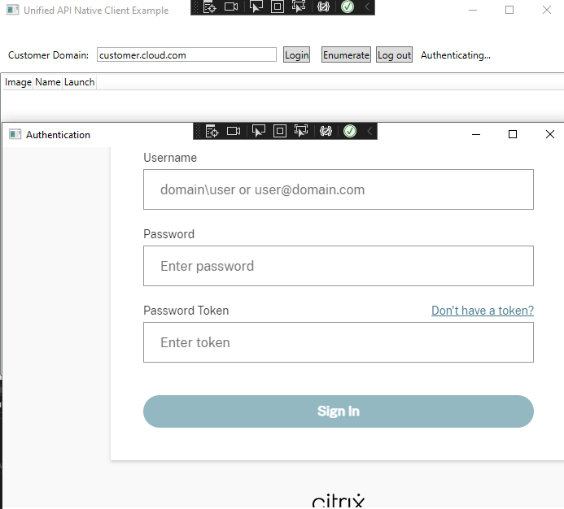
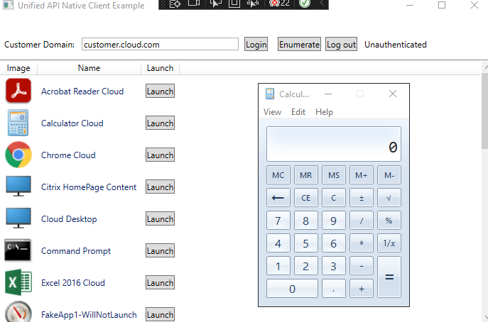

# Citrix(R) Unified Workspace API - Native Client sample built with Windows Presentation Foundation (WPF)

This is a simple implementation of a Windows Native Client that shows how to interact with the Citrix(R) Unified Workspace APIs to build a small and functional application. It is written using C#'s [WPF framework](https://github.com/dotnet/wpf), with a simple UI to facilitate the actions required to login and begin calling Workspace APIs.

It uses the provided sample Token Management Service ([TMS](./Citrix.UnifiedApi.Test.TMS/README.md)) as it's backend to handle OAuth tokens, and once its received a token calls the Workspace APIs.

This is purely an example and shouldn't be used for real production services.

## Sample site preview


## Prerequisites

- You have either a Private or Public Workspace OAuth Client
- You will be running the example code in Visual Studio and can run [.NET 7.0](https://dotnet.microsoft.com/en-us/download/dotnet/7.0)
- You have the [Citrix Workspace App](https://www.citrix.com/downloads/workspace-app/windows/workspace-app-for-windows-latest.html) installed

## Getting Started

### Run the provided sample Token Management Service (TMS)

To run this example, you must first be running the TMS.

You will need to configure the TMS Frontend settings in the `appsettings.Development.json` file as follows:

```json
"FrontEnd": {
    "FrontEndRedirectUrl": "https://localhost:3000/",
    "FrontEndCorsOrigin": "https://localhost:3000"
}
```

This is because the Application is configured to run on `https://localhost:3000`.

Before running the Native example, you will need to set the Application ID in the [app.config](./Citrix.UnifiedApi.Test.NativeClientWpf/App.config) to be the application ID for the OAuth client you have created in the Citrix Cloud Admin Console.

## Actions covered in this example

- Login / Logout
- In-memory storage of access token
- Refreshing of access token using a Token Management Service (TMS)
- Enumeration of resources for a user
  - If you have web or SaaS apps present in the store you're enumerating from, they will show in the list, but will not be able to be launched
- Launching of an ICA resource

## Running the example

- Recommend using an Incognito browser to avoid cookie and cache causing problems.

Once started, you should be directed to the login page:


At this point, enter your customer.cloud.com address and hit 'login'.

It should direct you to the standard login flow:



After entering your login details it will take you to the empty home page and say 'Authenticated':


Clicking on 'Enumerate' should call Workspace APIs to get your resources:


Clicking on a resources 'Launch' button should initiate a launch:




## Attributions

The code in this repository makes use of the following NuGet packages:

- Microsoft.Web.WebView2 (https://learn.microsoft.com/en-us/microsoft-edge/webview2/)

## License

Copyright &copy; 2023. Cloud Software Group, Inc. All Rights Reserved.
